### 🎓 Engineering Student & Tech Enthusiast

Mahasiswa semester 6 <b>Universitas Pendidikan Indonesia</b>.
 Fokus utamaku adalah <b>Data Science</b> dan <b>Systems Engineering (IoT & Embedded Systems)</b>.
 Keahlian utama ini didukung oleh latar belakang <b>Automation & Electrical Engineering</b> sebagai ilmu pelengkap, dengan selalu mengedepankan prinsip Keselamatan dan Kesehatan Kerja <b>(K3)</b>.

  
  

---

### 🚀 About Me

- 🔭 **Current Projects:**
  - Mengembangkan **AI-HESS** (Sistem Penyimpanan Energi Hibrida berbasis AI).
  - Menyusun riset tentang **Digital Twin technology** untuk Battery Management Systems.
- 🎯 **Domain Knowledge:**
  - Data Science & Analytics
  - Systems Engineering (IoT & Intelligent Systems)
  - Automation & Electrical Engineering.
- 🌱 **Currently Learning:** Generative AI, Deep Learning, Edge AI, dan Firmware.
- 💬 **Ask me about:** Analisis Data, Arsitektur IoT, Embedded C++, Python, dan Otomasi Sistem.
- ⚡ **Personal Values:** Optimis, Ikhtiar, Tawakal (OIT).

---

### 💻 Tech Stack & Professional Tools

 

<b>📈 Value Investing & Data Analytics</b>

  
  
  
  

<b>🧠 Data Science & Artificial Intelligence</b>

  
  
  
  
  
   
  
  
  
  
   
  
  
  
  
   
  
  
  
  
   
  
  
  
  

<b>⚙️ Systems Engineering, Automation & IoT</b>

  
  
  
  
  
   
  
  
  
  
   
  
  
  
  

<b>🛠️ Core Dev Tools & Deployment</b>

  
  
  
  
  
   
  
  
  

---

### 📊 GitHub Analytics

  
  

 

  <picture>
    <source media="(prefers-color-scheme: dark)" srcset="https://raw.githubusercontent.com/Ripanrz/Ripanrz/output/github-contribution-grid-snake-dark.svg">
    <source media="(prefers-color-scheme: light)" srcset="https://raw.githubusercontent.com/Ripanrz/Ripanrz/output/github-contribution-grid-snake.svg">
    
  </picture>

---
### 🌐 Social Media Accounts

  
  
  

